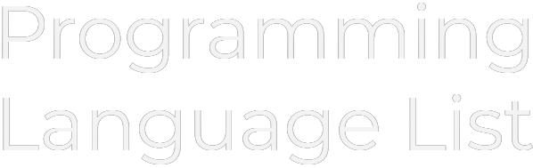

### ****NOTE:** This is a brand new repository, it'll be a while before it is ready.

    
<!-- The Programming Language List Banner -->
    

<em>
    <!-- Direct Links to Socials and other parts of the Repository. -->
        
[**License: CC BY-SA 4.0**](https://github.com/Maniacxxx/programming-language-list/blob/main/LICENSE) **·** 
[**Language List**](https://github.com/Maniacxxx/programming-language-list/blob/main/Language-List.md) **·** 
[**Translations**](https://github.com/Maniacxxx/programming-language-list/blob/main/Translations-List.md) **·** 
[**Contribute**](https://github.com/Maniacxxx/programming-language-list/blob/main/CONTRIBUTING.md) **·** 
[**FAQ**](https://github.com/Programming-Language-List/programming-language-list/blob/main/FAQ) **·** 
[**Twitter**](https://twitter.com/ListLanguage) **·** 
[**Discord (Coming Soon)**]()
    </em>

  
---
    <!-- The Body. -->

## Our Goal
Instead of just simply showing you how to print "Hello World" in a bunch of languages. Our goal is to have a multitude of Programming Languages listed with information like their history, their use and more.

## Check it out
If you want to see our progress check out the [Language List](https://github.com/Maniacxxx/programming-language-list/blob/main/Language-List.md). From there just click the name of the language to be directed to the Language's markdown file.

## How to Contribute
We know that this project is going to be long and difficult, but you can help! If you are intrested in Contributing click [Here](https://github.com/Maniacxxx/programming-language-list/blob/main/CONTRIBUTING.md).

## Thanks to...
- [The Hello World Collection](http://helloworldcollection.de/) for their list of programming Languages.
- And our [Contributors](#List-of-Contributors).

## List of Contributors
*None as of this moment*
